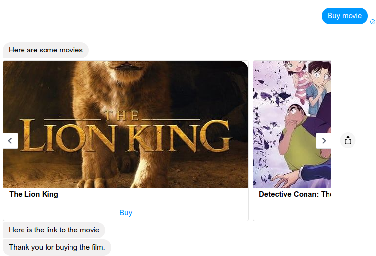

# Chatbot Example : Buy a movie

 

After click on Buy button

 

## Prerequisites

1. Create [ Stripe account](https://stripe.com). Get public and pirvate keys
2. Create [The Movie DB account](https://www.themoviedb.org/). Get private key (settings > API)
3. Create [NewBot Cloud account](https://app.newbot.io). Get only public key (settings > API)

> NewBot must be installed (`npm install -g newbot-cli`)

## Installation

`git clone git@github.com:newbotjs/chatbot-example-stripe.git`
`cd chatbot-example-stripe`
`npm install`

## Configuration

In `webviews/js/config.js` :

```js
const  NEWBOT_PUBLIC_KEY  =  '<Your NewBot Cloud Public Key>'
const  STRIPE_PUBLIC_KEY  =  '<Your Stripe Public Key>'
```

## Start

```
export MOVIE_DB_KEY=<Your The Movie Db Private Key>
export STRIPE_KEY=<Your Stripe Private Key>
newbot serve
```

Open  [Bot Framework Emulator](https://newbot.io/en/docs/essential/emulator.html) and test with a sentence :  `Buy a movie`

## Deploy on NewBot Cloud

1. Go to [NewBot Cloud account](https://app.newbot.io)
2. Create Environment variables
	a. Go to Build > Data > Add
	b. Put a name (`Movies` for example) and select `Environment variables`. Click on `validate`
	c. Click on `Add` button to add data
	d. Add `MOVIE_DB_KEY` in `Key` and your The Movie Db Private Key in `Value`
	e. Add new data and add `STRIPE_KEY` in `Key` and your Stripe Private Key in `Value`
3. In your project, deploy with this command : `newbot deploy`